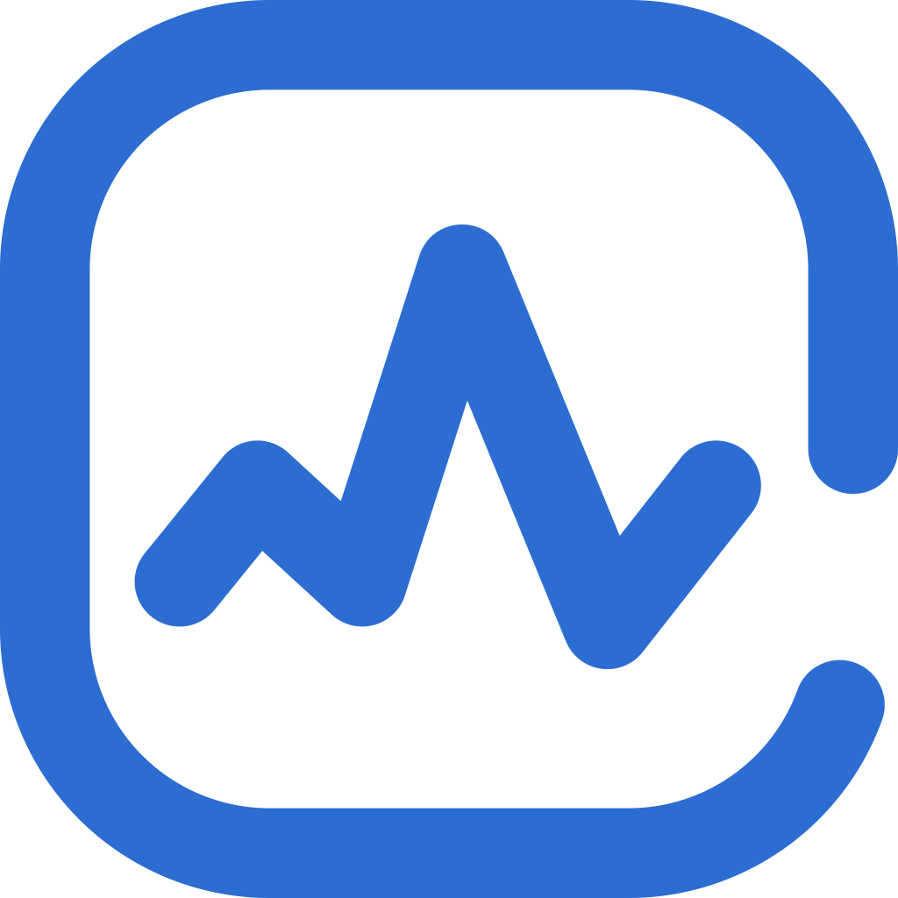

<p align="center">
    
    
</p>
<p align="center">
    <strong>
        A
        <a href="https://kubernetes.io/">Kubernetes </a>
        controller for Prometheus Anomaly Detection
    </strong>
</p>

[](https://github.com/jthomperoo/predictive-horizontal-pod-autoscaler/actions)
[](https://pkg.go.dev/github.com/jthomperoo/predictive-horizontal-pod-autoscaler)
[](https://goreportcard.com/report/github.com/jthomperoo/predictive-horizontal-pod-autoscaler)
[](https://predictive-horizontal-pod-autoscaler.readthedocs.io/en/latest)

## K8S Anomaly Detection Operator

K8S Anomaly Detection Operator is a controller to help manage Detector deployments for a Kubernetes cluster using CRDs (Custom Resource Defenitions).
Detector deployments allow you to configure Prometheus endpoints + PromQL expressions and some extra configuration to monitor/alert on anomalies found for a given timeframe.

# Why would I use it?

This operator lets you choose metrics and fine tune the configuration in order to detect anomalies over time inside of your system in a simple, scalable manner,
preempting events such as regular, repeated high load. This allows for proactive rather than simply reactive maintenance
of production environments and make intelligent ahead of time decisions.

# What systems would need it?

Systems that have predictable trends in metrics, for example; if over a 24 hour period the load on a resource is
generally higher between 3pm and 5pm - with enough data and use of correct configurations the detector could
expose an anomaly and push a notification to the relevant team in order to look deeper into it, increasing responsiveness of the system to changes in metrics.

## Features

* Integrates simply with Prometheus metrics.
* Leverages Prophet framework by facebook [https://github.com/facebook/prophet](https://github.com/facebook/prophet)
* Allows customization of Kubernetes resource spec. Can work on managed solutions such as EKS or GCP.
* Light weight and scalable
* Simplified configuration and easy integration

## What does a Detector object look like?

`Detectors` are designed to be as sinple as possible, with some optional
configuration options.

`Detectors` have their own custom resource:

```yaml
apiVersion: monitoring.amitdebachar/v1alpha1
kind: Detector
metadata:
  name: minimal-detector
spec:
  image: "amitde7896/anomaly-operator:0.1.1-detector"
  prom_url: "http://prometheus.monitoring.svc.cluster.local"
  interval_mins: "15"
  queries: 
  - name: "sum_pods_running_anomaly"
    query: 'sum(kube_pod_status_phase{phase=~"Running", pod=~"application-pod-.*"}) > 1'
    train_window: "14d"

```

This Detector, in a 15 minutes intervals, will query prometheus for the `kube_pod_status_phase` metrics in the past 2 weeks (14d), evaluate and try to find anomalies in the past 1 hour (configurable) based on the trained trend.

## Installation

The operator for managing `Detectors` can be installed using Helm:

```bash
git clone https://github.com/amitde69/anomaly-operator
helm install anomaly-operator helm/
```

## Quick start

Check out the [getting started
guide](https://amitde69.github.io/anomaly-operator/getting_started/configurations/) and the
[examples](./examples/) for ways to use `Detectors`.

## More information

See the [wiki for more information, such as guides and
references](https://amitde69.github.io/anomaly-operator/).

See the [`examples/` directory](./examples) for working code samples.