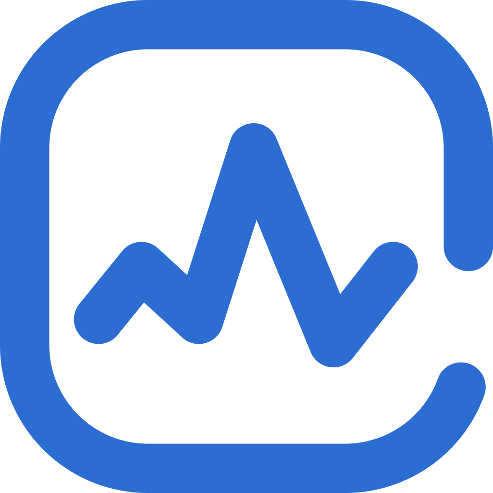

    
    

    <strong>
        A
        <a href="https://kubernetes.io/">Kubernetes </a>
        controller for Prometheus Anomaly Detection
    </strong>

    
    <!--  -->
    <!--  -->

    
    
    
    
    <!-- <a href="https://hub.docker.com/r/amazon/aws-alb-ingress-controller/">
         -->
    </a>

## K8S Anomaly Detection Operator

Visit the GitHub repository at <https://github.com/amitde69/anomaly-operator> to see examples,
raise issues, and to contribute to the project.

# What is it?

K8S Anomaly Detection Operator is a controller to help manage Detector deployments for a Kubernetes cluster using CRDs (Custom Resource Defenitions).
Detector deployments allow you to configure Prometheus endpoints + PromQL expressions and some extra configuration to monitor/alert on anomalies found for a given timeframe.

# Why would I use it?

This operator lets you choose metrics and fine tune the configuration in order to detect anomalies over time inside of your system in a simple, scalable manner,
preempting events such as regular, repeated high load. This allows for proactive rather than simply reactive maintenance
of production environments and make intelligent ahead of time decisions.

# What systems would need it?

Systems that have predictable trends in metrics, for example; if over a 24 hour period the load on a resource is
generally higher between 3pm and 5pm - with enough data and use of correct configurations the detector could
expose an anomaly and push a notification to the relevant team in order to look deeper into it, increasing responsiveness of the system to changes in metrics.

## Features

* Integrates simply with Prometheus metrics.
* Leverages Prophet framework by facebook [https://github.com/facebook/prophet](https://github.com/facebook/prophet)
* Allows customization of Kubernetes resource spec. Can work on managed solutions such as EKS or GCP.
* Light weight and scalable
* Simplified configuration and easy integration

